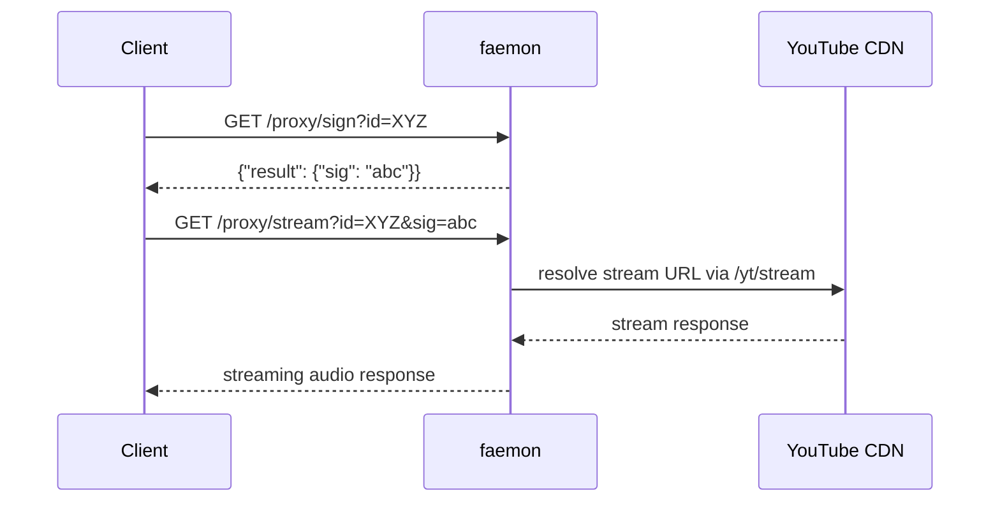

<h1 align="center">faemon</h1>

<p align="center">
  A high-performance local music service that provides a clean HTTP API<br>
  over <strong>YouTube</strong> and <strong>YouTube Music</strong>, designed for zero-latency<br>
  background music playback with parallel I/O processing.
</p>

<p align="center">
  
  <a href="https://discord.gg/z6YWYB9382"></a>
  
</p>

---

## Features

- **Stream Resolution** — Extracts best-quality audio stream URLs from YouTube with automatic retry and TTL-based caching
- **YouTube Search** — Search videos, playlists, and channels with type filtering
- **YouTube Music** — Full access to search, playlists, albums, artists, and radio/shuffle watch playlists
- **Search Suggestions** — Real-time YouTube autocomplete suggestions
- **Stream Proxy** — Built-in authenticated proxy that streams audio through the local server, bypassing CORS and header restrictions
- **CORS** — Global `allow-origin: *` middleware applied to all endpoints
- **Bearer Token Auth** — Auto-generated token on startup; all endpoints except health/proxy require authorization
- **Handshake Protocol** — Prints `{"port": ..., "token": ...}` to stdout on boot for parent process discovery
- **Single Binary** — PyInstaller builds for macOS, Linux, and Windows (x64 + ARM)

## Quick Start

### Download

Grab the latest binary for your platform from [Releases](https://github.com/EXONED/faemon/releases).

### Run

```sh
./faemon [options]
```

On startup, faemon binds to a random localhost port and prints a handshake to stdout:

```json
{"port": 52431, "token": "abc123..."}
```

All subsequent API requests must include the token:

```
Authorization: Bearer <token>
```

### CLI Options

| Flag | Default | Description |
|------|---------|-------------|
| `--language` | `en` | YouTube Music language code |
| `--location` | `""` | YouTube Music location code |
| `--max-proxy-sessions` | `20` | Max concurrent proxy stream sessions |

## API Reference

All endpoints are prefixed with the server's base URL (e.g. `http://127.0.0.1:<port>`). All `GET` endpoints return JSON with the standard response format (see [Response Format](#response-format) below).

---

### `GET /health`

Health check. **No auth required.**

```json
{"result": {"status": "ok"}, "elapsed": null}
```

---

### `GET /yt/search`

Search YouTube for videos, playlists, and channels.

| Parameter | Required | Default | Description |
|-----------|----------|---------|-------------|
| `q` | Yes | — | Search query string |
| `limit` | No | `20` | Maximum number of results |
| `type` | No | `all` | Result type filter. One of: `all`, `videos`, `playlists`, `channels` |

Each result entry contains:

```json
{
  "id": "dQw4w9WgXcQ",
  "title": "Rick Astley - Never Gonna Give You Up",
  "type": "video",
  "url": "/watch?v=dQw4w9WgXcQ",
  "description": null,
  "duration": 212.0,
  "view_count": "1400000000",
  "artists": [{"name": "Rick Astley", "id": "..."}],
  "album": null,
  "is_explicit": null,
  "thumbnails": [{"url": "...", "width": 360, "height": 202}]
}
```

---

### `GET /yt/playlist`

Fetch a YouTube playlist and its entries.

| Parameter | Required | Default | Description |
|-----------|----------|---------|-------------|
| `id` | Yes | — | Playlist ID or full YouTube URL |

Returns:

```json
{
  "id": "PLrAXtmErZgOeiKm4sgNOknGvNjby9efdf",
  "title": "My Playlist",
  "availability": "public",
  "description": null,
  "authors": [{"name": "User", "id": "..."}],
  "thumbnails": [],
  "entries": ["...array of entry objects..."],
  "year": null,
  "view_count": "1234",
  "track_count": 42,
  "browse_id": null,
  "other_versions": null,
  "related_recommendations": null
}
```

---

### `GET /yt/stream`

Resolve the best audio-only stream URL for a YouTube video. Uses a TTL-based cache (capacity: 128 entries, FIFO eviction) with liveness checks — every cache hit also sends a `HEAD` request to verify the URL is still reachable. Repeated requests for the same video will be served from cache as long as the URL is both unexpired and alive. If a cached URL is dead or expired, it's evicted and a fresh one is extracted (up to 3 retries).

| Parameter | Required | Default | Description |
|-----------|----------|---------|-------------|
| `id` | Yes | — | YouTube video ID (11 characters) |
| `format` | No | — | yt-dlp format override. When set, the stream cache is keyed as `id:format` so override results never poison the default cache entry. |

Returns:

```json
{
  "url": "https://rr1---sn-....googlevideo.com/videoplayback?...",
  "expires_at": 1712345678,
  "http_headers": {"User-Agent": "...", "Referer": "..."}
}
```

- `expires_at` — Unix timestamp of when the URL expires (extracted from the `expire` query param), or `null`
- `http_headers` — Headers required to access the stream URL, or `null`
- `elapsed` will be `null` when served from cache

---

### `POST /yt/extract`

Raw yt-dlp extraction pass-through. Accepts a JSON body and returns whatever yt-dlp produces.

**Body:**

```json
{
  "query": "https://www.youtube.com/watch?v=dQw4w9WgXcQ",
  "options": {"format": "bestaudio", "extract_flat": true}
}
```

| Field | Required | Description |
|-------|----------|-------------|
| `query` | Yes | URL or search query to pass to yt-dlp |
| `options` | No | Dict of yt-dlp options (merged with `quiet: true, no_warnings: true`) |

Returns the raw yt-dlp output under `result`.

---

### `GET /ytm/search`

Search YouTube Music.

| Parameter | Required | Default | Description |
|-----------|----------|---------|-------------|
| `q` | Yes | — | Search query string |
| `limit` | No | `20` | Maximum number of results |
| `filter` | No | `null` | Result type filter. One of: `songs`, `videos`, `albums`, `artists`, `playlists`, `community_playlists`. Omit for all types |

Each result entry contains:

```json
{
  "id": "dQw4w9WgXcQ",
  "title": "Never Gonna Give You Up",
  "type": "song",
  "url": null,
  "description": null,
  "duration": 212,
  "view_count": null,
  "artists": [{"name": "Rick Astley", "id": "UC..."}],
  "album": {"name": "Whenever You Need Somebody", "id": "MPREb_..."},
  "is_explicit": false,
  "thumbnails": [{"url": "...", "width": 60, "height": 60}]
}
```

---

### `GET /ytm/playlist`

Fetch a YouTube Music playlist.

| Parameter | Required | Default | Description |
|-----------|----------|---------|-------------|
| `id` | Yes | — | Playlist ID. Also accepts full YouTube Music URLs — the `list=` parameter will be extracted automatically |

Returns the same shape as the YouTube playlist endpoint (see above).

---

### `GET /ytm/album`

Fetch a YouTube Music album with track listing, other versions, and related recommendations.

| Parameter | Required | Default | Description |
|-----------|----------|---------|-------------|
| `id` | Yes | — | Album browse ID (e.g. `MPREb_...`) |

Returns:

```json
{
  "id": "MPREb_...",
  "title": "Whenever You Need Somebody",
  "availability": null,
  "description": null,
  "authors": [{"name": "Rick Astley", "id": "UC..."}],
  "thumbnails": [],
  "entries": ["...array of track entry objects..."],
  "year": "1987",
  "view_count": null,
  "track_count": 10,
  "browse_id": "MPREb_...",
  "other_versions": ["...array of album objects or null..."],
  "related_recommendations": ["...array of album objects or null..."]
}
```

---

### `GET /ytm/artist`

Fetch a YouTube Music artist profile with their songs, albums, singles, videos, and related artists.

| Parameter | Required | Default | Description |
|-----------|----------|---------|-------------|
| `id` | Yes | — | Artist channel ID (e.g. `UCu...`) |

Returns:

```json
{
  "name": "Rick Astley",
  "description": "...",
  "views": "14,000,000,000 views",
  "channelId": "UCu...",
  "shuffleId": "RDA...",
  "radioId": "RDAMVM...",
  "subscribers": "7.2M",
  "monthlyListeners": "37.2M",
  "subscribed": false,
  "thumbnails": [],
  "songs": {"results": ["...entry objects..."]},
  "albums": {"results": ["...entry objects..."]},
  "singles": {"results": ["...entry objects..."]},
  "videos": {"results": ["...entry objects..."]},
  "related": {"results": ["...entry objects..."]}
}
```

Each section (`songs`, `albums`, `singles`, `videos`, `related`) may be `null` if not available for the artist.

---

### `GET /ytm/watch-playlist`

Fetch the watch playlist (queue) for a given video or playlist. Supports radio and shuffle modes.

| Parameter | Required | Default | Description |
|-----------|----------|---------|-------------|
| `id` | Yes | — | Video ID (11 characters) or playlist ID. If 11 chars, treated as a video ID; otherwise as a playlist ID |
| `limit` | No | `25` | Maximum number of tracks |
| `radio` | No | `false` | Enable radio mode. Accepts `1` or `true` |
| `shuffle` | No | `false` | Shuffle the playlist. Accepts `1` or `true` |

Returns an array of track entries.

---

### `GET /suggestions`

Fetch YouTube autocomplete suggestions for a query.

| Parameter | Required | Default | Description |
|-----------|----------|---------|-------------|
| `q` | Yes | — | Partial search query |

Returns:

```json
{"result": ["rick astley", "rick roll", "rick and morty", "..."], "elapsed": 0.031}
```

---

### Stream Proxy

The proxy system lets you stream audio directly through the faemon server, bypassing CORS and header restrictions that browsers and some clients face when hitting Google's CDN directly. It uses a **two-step sign-based authentication flow** — you must generate a signature before streaming, and each signature is bound to a specific video ID.

#### Step 1: `GET /proxy/sign`

Generate a proxy signature for a video. **Requires auth.**

| Parameter | Required | Default | Description |
|-----------|----------|---------|-------------|
| `id` | Yes | — | YouTube video ID |

Returns:

```json
{"result": {"sig": "a1B2c3D4..."}, "elapsed": null}
```

#### Step 2: `GET /proxy/stream`

Stream audio through the local server. **No auth header required** — authentication is handled by the signature.

| Parameter | Required | Default | Description |
|-----------|----------|---------|-------------|
| `id` | Yes | — | YouTube video ID |
| `sig` | Yes | — | Signature obtained from `/proxy/sign` |

The server resolves the stream URL internally, fetches it from YouTube's CDN, and pipes the response back to you. The following upstream headers are forwarded:

- `content-type`
- `content-length`
- `content-range`
- `accept-ranges`

**Range requests are supported** — include a `Range` header in your request and it will be forwarded to the upstream CDN. This enables seeking in audio players.

`access-control-allow-origin: *` is always set on the response, making it safe for browser-side playback.

#### Session Eviction and `--max-proxy-sessions`

Signatures are stored in a **FIFO session registry** capped at `--max-proxy-sessions` (default 20). Each call to `/proxy/sign` creates a new entry. When the registry is full, **the oldest signature is evicted to make room** — making it immediately invalid for any subsequent `/proxy/stream` call.

This means:

- **You must generate a new signature for each new video** you want to proxy.
- If you sign video B after signing video A and the session limit is reached, video A's signature is burned. Streaming video A will return a 401 error until you sign it again.
- With `--max-proxy-sessions 1`, only one signature exists at a time — signing any new video instantly invalidates the previous one.
- Signatures are not consumed after a single stream — a valid signature can be reused for the same video until it's evicted by newer signatures.

#### Proxy Flow Summary



#### Step 3: `GET /proxy/pcm`

Stream raw decoded PCM audio from an arbitrary offset. **Requires auth header** — unlike `/proxy/stream`, this endpoint sits behind the bearer middleware and additionally validates the per-video `sig` (obtain it the same way via `/proxy/sign`).

faemon resolves the upstream URL, opens it with PyAV (FFmpeg), seeks to `t`, decodes audio only, and resamples to a canonical format. This is the audio source for the Rust-side PCM player.

| Parameter | Required | Default | Description |
|-----------|----------|---------|-------------|
| `id` | Yes | — | YouTube video ID |
| `sig` | Yes | — | Signature obtained from `/proxy/sign` (bearer header also required) |
| `t` | Yes | — | Start offset in seconds (float, `>= 0`) |
| `format` | No | — | yt-dlp format override forwarded to `/yt/stream` (e.g. `bestaudio/best` to pin Opus/itag 251 regardless of platform default) |

Response: `application/octet-stream` — little-endian signed 16-bit stereo at a fixed 48 kHz. Response headers `x-sample-rate`, `x-channels`, `x-sample-format` advertise the format. Chunks of ~100 ms of audio are streamed as they are decoded; the stream ends at end of media. Seeking = start a new request with a different `t`.

---

### Response Format

All standard endpoints return:

```json
{
  "result": "<object or array>",
  "elapsed": 0.0421
}
```

- `result` — the response payload (type varies by endpoint)
- `elapsed` — wall-clock time in seconds for the operation, or `null` when served from cache

On error:

```json
{
  "error": "error message"
}
```

HTTP status codes: `400` for bad input, `401` for auth failures, `502` for upstream errors, `500` for internal failures.

## Architecture

```
src/
├── entry.py                 # PyInstaller entry point (calls faemon:main)
└── faemon/
    ├── __init__.py           # CLI entry point, argparse, handshake output
    ├── app.py               # Starlette app factory, auth + CORS middleware
    ├── cache.py             # TTL stream cache with liveness probes and FIFO eviction
    ├── helpers.py           # Response utilities
    ├── state.py             # Application state (config, cache, HTTP client)
    ├── routes/
    │   ├── __init__.py       # Route table assembly, health handler
    │   ├── yt.py            # YouTube route handlers
    │   ├── ytm.py           # YouTube Music route handlers
    │   ├── proxy.py         # Stream proxy with signed sessions
    │   └── suggestions.py   # Search suggestion handler
    └── services/
        ├── yt.py            # yt-dlp wrapper and response parsers
        ├── ytm.py           # ytmusicapi wrapper and response parsers
        └── suggestions.py   # Google suggestion fetcher
```

- **Routes** handle HTTP concerns — validation, timing, response formatting
- **Services** handle I/O — calling yt-dlp / ytmusicapi and parsing results
- **State** holds the shared `StreamCache`, `httpx.AsyncClient`, and proxy session registry
- All blocking I/O runs in thread pool executors via `asyncio.to_thread` to keep the event loop unblocked

## Development

Requires [uv](https://docs.astral.sh/uv/) and Python 3.14.

```sh
# Install dependencies
uv sync

# Run in dev mode
uv run poe dev

# Build binary
uv run poe build

# Clean build artifacts
uv run poe clean
```

### Release

Releases are handled through the [GitHub Actions workflow](.github/workflows/release.yml). Trigger it manually and select the version bump level (`patch`, `minor`, `major`, or `none`). It will:

1. Bump the version in `pyproject.toml`
2. Build binaries for all platforms (macOS ARM/x64, Linux ARM/amd64, Windows ARM/x64)
3. Smoke-test each binary via the handshake protocol
4. Create a GitHub Release with all binaries attached

## License

This project is licensed under [Apache-2.0](LICENSE).
